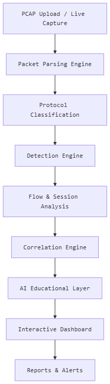
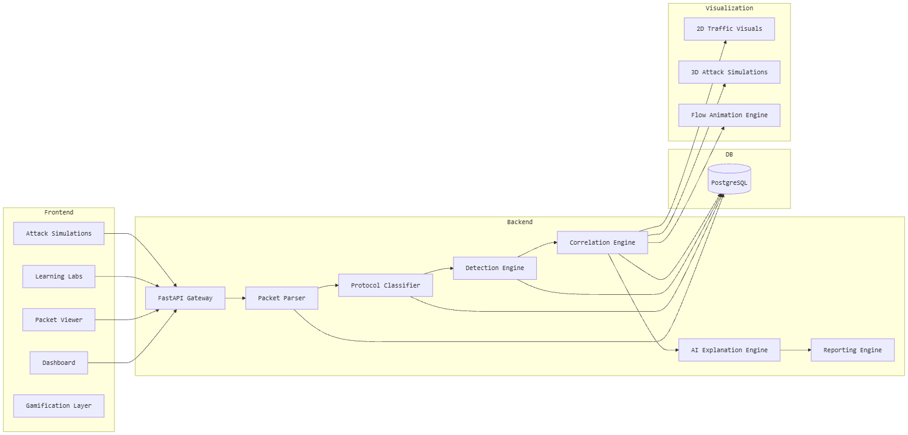
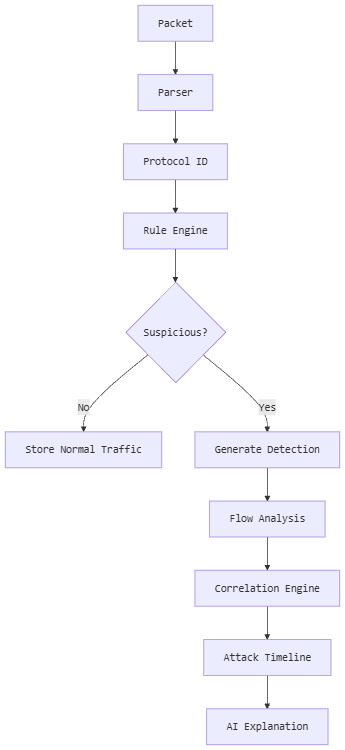
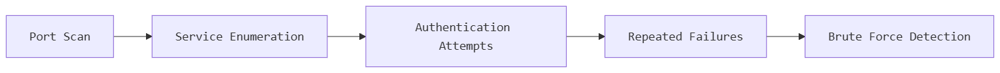

_**PacketPilot**_
AI‑Assisted Interactive Packet Analysis & SOC Training Platform

PacketPilot is an interactive cybersecurity learning platform that blends packet analysis, SOC investigation workflows, attack visualization, and AI-guided instruction into a single hands‑on experience. Built around Wireshark‑style traffic inspection, it helps students and analysts understand real-world network behavior, suspicious activity, and attack progression.
_
**Key Capabilities**_
- Packet & Protocol Analysis
- SOC‑Style Investigation Workflows
- Detection Pipelines (rules + behavioral patterns)
- Correlation Engine with Attack Timeline Reconstruction
- 2D & 3D Cyber Attack Visualization
- Interactive Labs & Guided Lessons
- AI‑Generated Explanations, Summaries & SOC Reasoning
- Reporting & Automation (PDF/CSV/Excel/Alerts)

_**High‑Level Workflow**_

  

_**System Architecture Overview**_

  

_**Core Components**_

_**1. Packet Parsing Engine**_

Responsibilities:

* PCAP / PCAPNG parsing
* Extract metadata
* Normalize packet structure
* Persist structured traffic

Tech Stack:

* TShark
* Scapy
* PyShark

_**2. Protocol Classification Engine**_

Identifies:
* TCP
* UDP
* HTTP/HTTPS
* DNS
* ICMP
* TLS
* SSH
* FTP
* SMB
* DHCP
* ARP
Also identifies anomalous or suspicious protocol usage.

_**3. Detection Engine**_

Detects:
* Port Scanning
* SYN Flood
* ICMP Flood
* ARP Spoofing
* DNS Tunneling Indicators
* C2 Beaconing
* Authentication Brute Force Attempts

Detection Workflow

  

Correlation Engine

Links together:
* Packets
* Sessions
* Flows
* Alerts
* Attack Phases

Example Attack Progression

  

